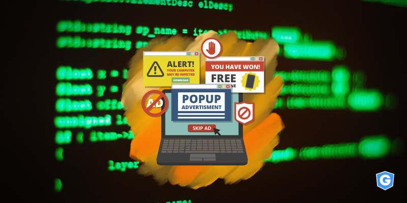
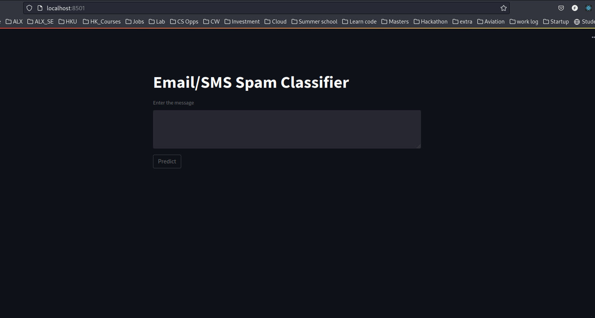

# SMS Spam Classifier

  

## 📌 Introduction:-

This an NLP Model that uses SMS data to predict whether the SMS is spam using These Machine Learning Algorthims: 

svc = SVC(kernel='sigmoid', gamma=1.0)
knc = KNeighborsClassifier()
mnb = MultinomialNB()
dtc = DecisionTreeClassifier(max_depth=5)
lrc = LogisticRegression(solver='liblinear', penalty='l1')
rfc = RandomForestClassifier(n_estimators=50, random_state=2)
abc = AdaBoostClassifier(n_estimators=50, random_state=2)
bc = BaggingClassifier(n_estimators=50, random_state=2)
etc = ExtraTreesClassifier(n_estimators=50, random_state=2)
gbdt = GradientBoostingClassifier(n_estimators=50,random_state=2)
xgb = XGBClassifier(n_estimators=50,random_state=2)

Data cleaning and processing techniques are done using the TFIDF Vectorizer 

## ✔❌Accuracy Summaries : Top Models  ❌✔:-

| Text Preprocessing Type              |     Accuracy        |
|--------------------------------------|---------------------|
|SVC                                   | 97.58%              |
|Multinomial NB                        | 97.09%              |
|Logistic Regression                   | 97.03%              |
|Random Forest                         | 97.58%              |          
|Extra Tree Classifier                 | 97.49%              |
|XGBClassifier                         | 97.49%              |    

## WorkFlow:-

## 🏁 Datasets Used:-

* The dataset used is SMS Spam Dataset created by UCI Machine Learning.This dataset is downloaded in kaggle.You can download it [here](https://www.kaggle.com/uciml/sms-spam-collection-dataset/download)

## 📧Contact:-
For any kind of suggesstions/ help in models code Please Message [me](franklinemisango4@gmail.com)

## 📜 LICENSE
[Apache ](https://github.com/FranklineMisango/Spam_Message_Classifier/blob/main/LICENSE)

## Installation

* Run `pipenv shell`
* Run `streamlit run app.py`
* The Model's website should open in a new Browser window 

